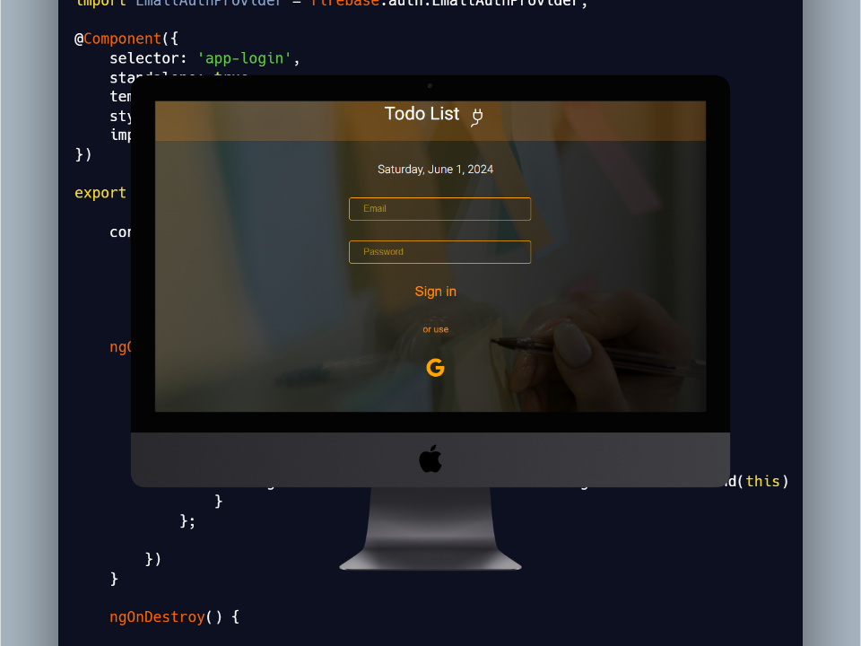

## TaskListBackEnd (https://todo-list.ferreiras.dev.br/)
API to be consumed by TaskList Angular-based frontend App, built with Spring Boot, Spring Security, MySQL and Java 17

## _Tools_
- Java 17
- Spring Boot
- Spring Security
- oAuth2
- MySQL
- IntelliJ Community Edition

## _Table of contents_
- [TaskListBackEnd (https://todo-list.ferreiras.dev.br/)](#skilcaptain-httpsskillcaptainapp)
- [_Tools_](#tools)
- [_Table of contents_](#table-of-contents)
- [_Screenshot_](#screenshot)
- [_Links_](#links)
- [_Built with_](#built-with)
- [_What I practiced_](#what-i-practiced)
- [_Continued development_](#continued-development)
  - [_Useful resources_](#useful-resources)
- [_Author_](#author)
- [Acknowledgments](#acknowledgments)


## _Screenshot_
[]()
## _Links_
- Live Site URL: [https://todo-list.ferreiras.dev.br]

## _Built with_

<p>
  <a href="https://skillicons.dev">
    
  </a>
</p>

 ## _How I am building_
```java

package br.dev.ferreiras.jwt.controllers.handlers;

import br.dev.ferreiras.jwt.controllers.dto.CustomError;
import br.dev.ferreiras.jwt.controllers.dto.ValidationError;
import br.dev.ferreiras.jwt.services.exceptions.DatabaseException;
import br.dev.ferreiras.jwt.services.exceptions.ForbiddenException;
import br.dev.ferreiras.jwt.services.exceptions.ResourceNotFoundException;
import jakarta.servlet.http.HttpServletRequest;
import org.springframework.http.HttpStatus;
import org.springframework.http.ResponseEntity;
import org.springframework.validation.FieldError;
import org.springframework.web.bind.MethodArgumentNotValidException;
import org.springframework.web.bind.annotation.ControllerAdvice;
import org.springframework.web.bind.annotation.ExceptionHandler;

import java.time.Instant;

@ControllerAdvice
public class ControllerExceptionHandler {
  @ExceptionHandler (ResourceNotFoundException.class)
  public ResponseEntity<CustomError> resourceNotFound(ResourceNotFoundException e, HttpServletRequest request) {
    HttpStatus status = HttpStatus.NOT_FOUND;
    CustomError err = new CustomError(Instant.now(), status.value(), e.getMessage(), request.getRequestURI());
    return ResponseEntity.status(status).body(err);
  }

  @ExceptionHandler(DatabaseException.class)
  public ResponseEntity<CustomError> database(DatabaseException e, HttpServletRequest request) {
    HttpStatus status = HttpStatus.BAD_REQUEST;
    CustomError err = new CustomError(Instant.now(), status.value(), e.getMessage(), request.getRequestURI());
    return ResponseEntity.status(status).body(err);
  }

  @ExceptionHandler(MethodArgumentNotValidException.class)
  public ResponseEntity<CustomError> methodArgumentNotValidation(MethodArgumentNotValidException e, HttpServletRequest request) {
    HttpStatus status = HttpStatus.UNPROCESSABLE_ENTITY;
    ValidationError err = new ValidationError(Instant.now(), status.value(), "Dados inválidos", request.getRequestURI());
    for (FieldError f : e.getBindingResult().getFieldErrors()) {
      err.addError(f.getField(), f.getDefaultMessage());
    }
    return ResponseEntity.status(status).body(err);
  }

  @ExceptionHandler(ForbiddenException.class)
  public ResponseEntity<CustomError> forbidden(ForbiddenException e, HttpServletRequest request) {
    HttpStatus status = HttpStatus.FORBIDDEN;
    CustomError err = new CustomError(Instant.now(), status.value(), e.getMessage(), request.getRequestURI());
    return ResponseEntity.status(status).body(err);
  }

}

``` 

## _Continued development_
- Next step: Java 21 Virtual Threads.
- 
### _Useful resources_
- [https://docs.oracle.com/en/java/] Always trust and read the official documentation!
- [https://spring.io/] trust and read the official documentation!
- [https://jwt.io/] the place to decode and verify your JWTs
## _Author_
- Website - [https://ferreiras.dev.br] 
## Acknowledgments
